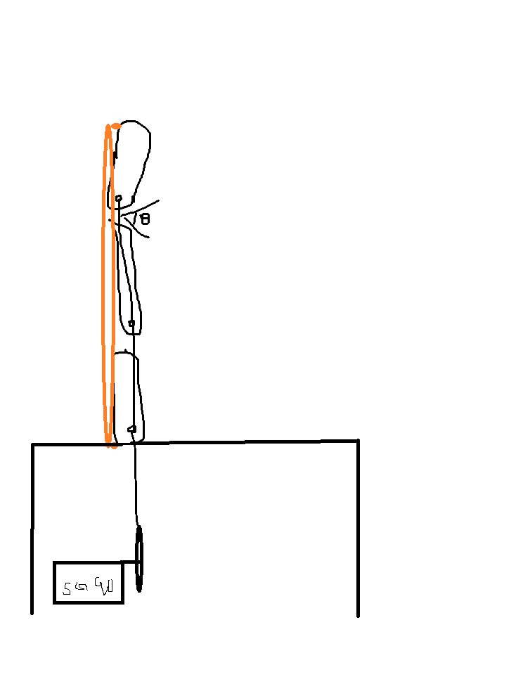
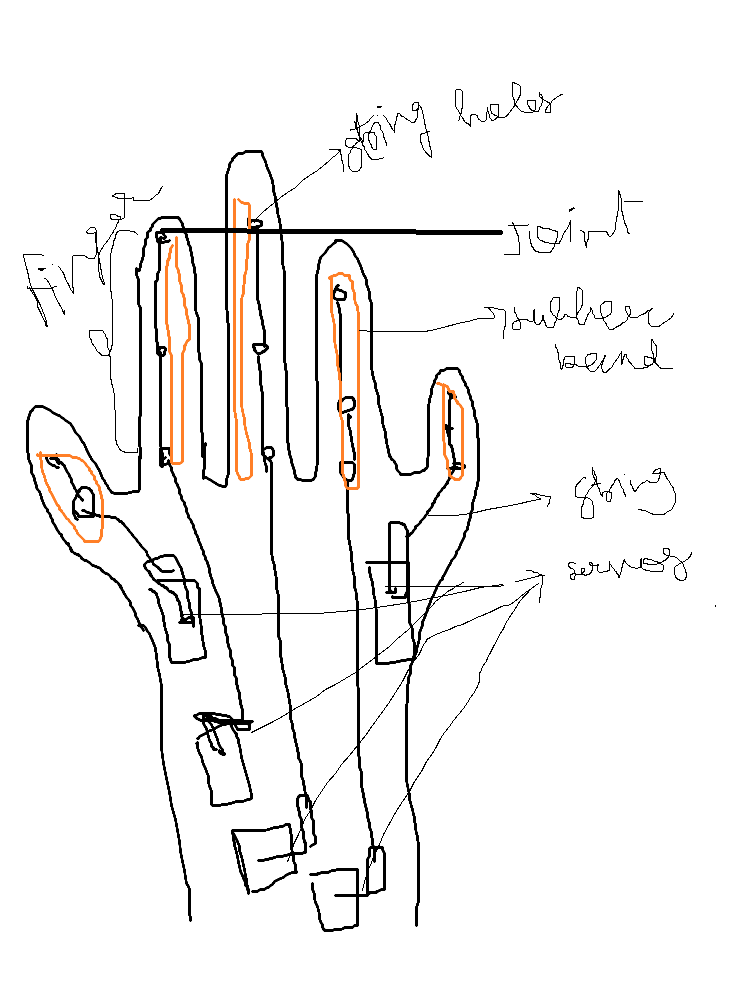
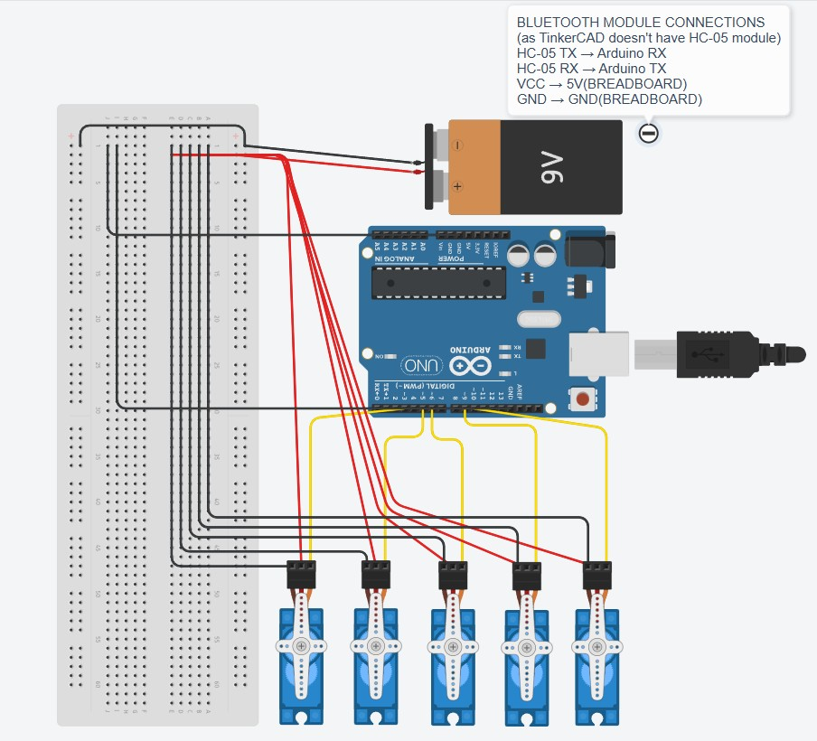

# Modular Bluetooth-Controlled Prosthetic Hand with Adaptive Grip System

---

# What it is

This project is a modular robotic prosthetic hand that uses a tendon-driven mechanism and servo motors to copy how a human finger moves. A Bluetooth module lets you control the system wirelessly, giving you access to different grip modes and the ability to control each finger from a mobile device.

---

## Why I Did This

I made this project to learn how mechanical design, embedded electronics, and control systems work together in real-life assistive robots. I didn't just make a simple servo demo; I made a whole system that shows how a real prosthetic hand could work.

---
## CAD

#### STEP Format files-

    CAD/3D%20Files%20Robo%20Hand

---

#### F3D & F3Z Format files-

    CAD/ROBO%20hand%20files(f3d)

---

## CAD of the project

#### Full CAD Model- 
    CAD\ROBO hand files(f3d)\hand_3D_RENDER.f3z

---

##### 3D_render

.jpg)

---

##### More View

.jpg)

---

#### Design

##### Finger design

---

##### Full Hand design

---

## Electronics

### TinkerCAD link
https://www.tinkercad.com/things/5ojhNEz72F2-circuit-prosthetichand/editel?returnTo=https%3A%2F%2Fwww.tinkercad.com%2Fdashboard%2Fdesigns%2Fcircuits&sharecode=ptQnLJyK70PxerSe2FhhfwA5_K1Ssgsr-BoHAHVJKSI

---

### Wiring Diagram

---

### TinkerCAD Simulation

.jpg)

---

This project does not use a PCB, so please note. All of the connections are made using a breadboard for prototyping.

---

## A Look at the System

## Parts Used

* Arduino UNO R3
* 5 Servo Motors (SG90/MG90S)
* Bluetooth Module HC-05
* Pack of 18650 batteries
* Breadboard and jumper wires
* Elastic thread and nylon thread (tendon system)

---

## Information about the wiring

### Connections for the Servo

* D3 to Servo 1
* D5 to Servo 2
* D6 → Servo 3
* D9 to Servo 4
* D10 → Servo 5

### Bluetooth Module

* HC-05 TX to Arduino RX
* HC-05 RX to Arduino TX

### Power

* External battery powers servos
* All the grounds are connected to each other (common ground)

---

## Firmware

The prosthetic hand can be set up to have different grip modes or to let each finger move on its own.
It is presnt at-
    [Firmware](Firmware/hand_control.ino)

---

### Modes of Grip

* **O** = Open Hand
* **P** → Power Grip
* **I** → Pinch Grip
* **H** → Partial Grip

## Control of Each Finger

* **A / a** → Open / Close Finger 1
* **B / b**: Open and close finger 2
* **C** / **c**: Open or close Finger 3
* **D / d** → Open / Close Finger 4
* **E / e** means to open or close Finger 5

The movement is done with incremental servo transitions, which make the motion smoother and more controlled.

---

## Files That Are Included

* `/CAD` → files for STEP and Fusion 360
* `/Firmware` → code for Arduino
* `/Electronics`→ leads to a wiring diagram and a simulation
* `/Design` → Pictures of the design that have been made
* `BOM.csv` → List of all parts

---

## Bill of Materials (BOM)

| Name                           | Purpose                     | Quantity | Total Cost (USD) | Link                                                                                            | Distributor   |
| ------------------------------ | --------------------------- | -------- | ---------------- | ----------------------------------------------------------------------------------------------- | ------------- |
| Loctite Super Glue Power Gel   | Sticking 3d printed parts   | 1        | 4.00             | https://www.amazon.in/Loctite-Flexible-Superglue-Non-Drip-Applications/dp/B001C42J9I            | AMAZON        |
| 3D Printing Material (PLA/ABS) | Material for printing parts | 1        | 4.00             | https://almightyfila.com/product/pla-3d-printing-filament/                                      | ALMIGHTY FILA |
| Screws & Fasteners             | Assembly components         | 6        | 0.50             | https://robu.in/product/easymech-ss-304-csk-countersunk-philips-head-m2-5-x-6-mm-bolt-25-pcs-2/ | ROBU          |
| Nylon thread                   | Tendon Mechanism            | 1        | 2.00             | https://www.meesho.com/ultra-thin-strong-bright-nylon-high-tensile-strength-thread              | MEESHO        |
| Elastic Thread 2mm             | Tendon pullback mechanism   | 1        | 1.00             | https://www.meesho.com/elastic-band-cord-2mm                                                    | MEESHO        |
| Breadboard                     | Prototyping board           | 1        | 0.50             | https://robocraze.com/products/half-breadboard                                                  | ROBOCRAZE     |
| Jumper Wires (M-M & M-F)       | Electrical connections      | 20       | 0.50             | https://robocraze.com/products/f2m-jumper-wires-20cm-40pcs                                      | ROBOCRAZE     |
| 3.7V 2900mAh 18650 Battery     | Power supply                | 2        | 3.00             | https://robocraze.com/products/3-7v-2900mah-18650-battery                                       | ROBOCRAZE     |
| HC-05 Bluetooth Module         | Wireless communication      | 1        | 2.50             | https://robocraze.com/products/hc-05-bluetooth-module                                           | ROBOCRAZE     |
| Arduino UNO R3                 | Microcontroller board       | 1        | 19.00            | https://robocraze.com/products/arduino-uno-original                                             | ROBOCRAZE     |
| Servo Motor (SG90/MG90S)       | Finger actuation            | 5        | 5.00             | https://robocraze.com/products/sg90-micro-servo-motor                                           | ROBOCRAZE     |

---

## Current Status

The CAD model, electronics design, and firmware are all done. The system is ready to be put together and tested in real life.

---

## Improvements for the Future

* Putting things together and testing them
* Better routing of tendons
* Design of custom PCBs
* Better control of the grip

---

## Last Thoughts

This project shows how to build a robotic prosthetic hand from start to finish by combining mechanical design, electronics, and control software into a single working prototype.

---
