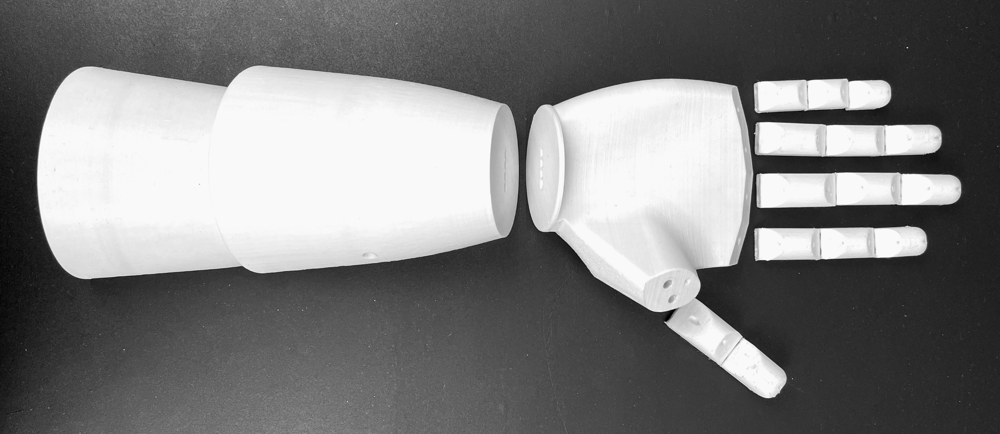
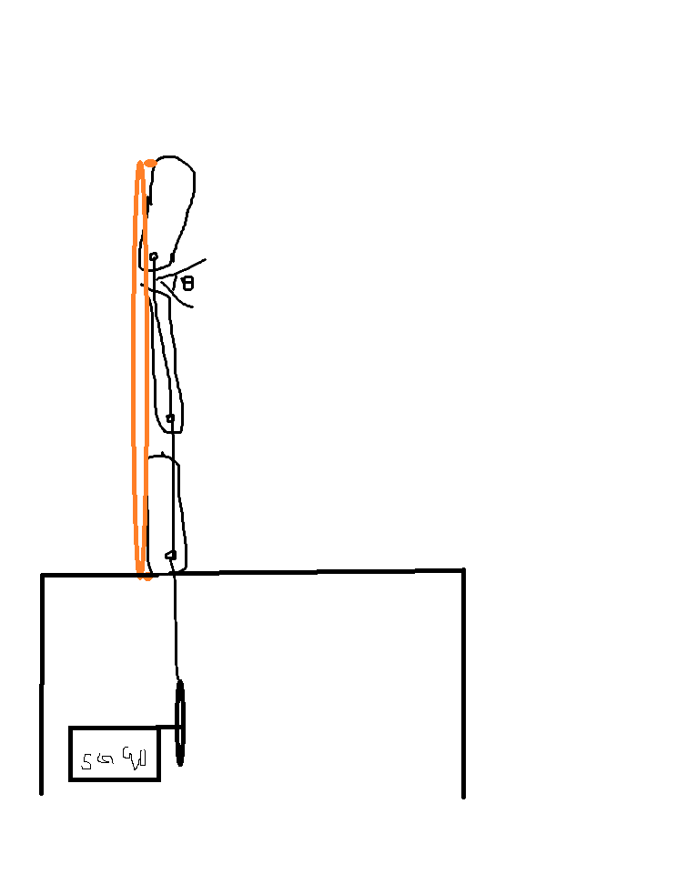
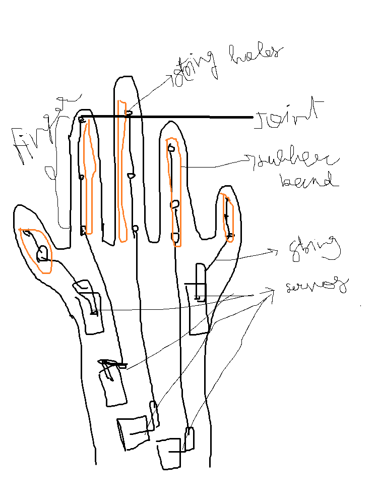
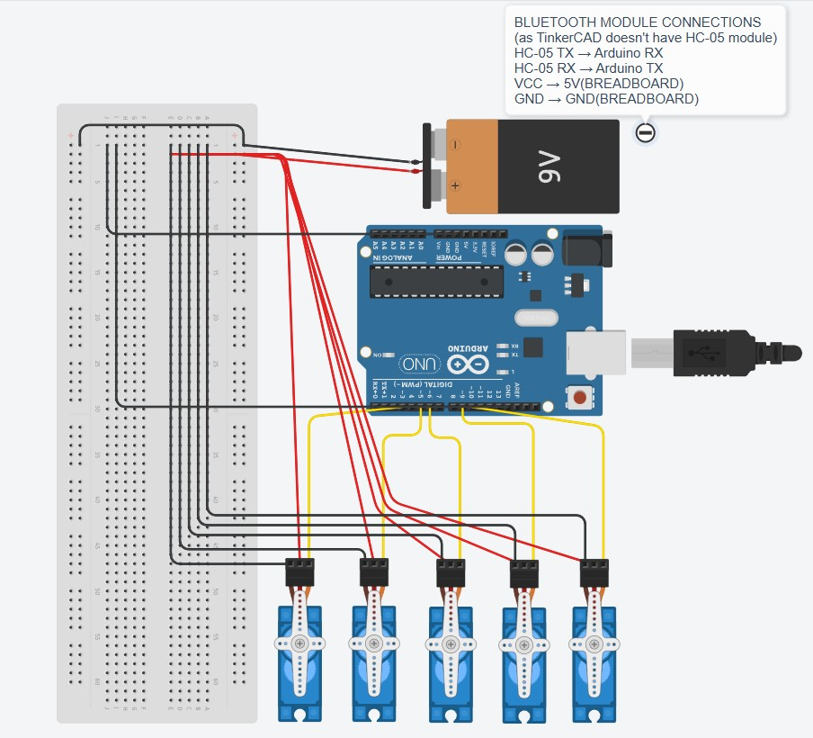

# Modular Bluetooth-Controlled Prosthetic Hand with Adaptive Grip System

---

# What it is

This project is a simple prosthetic hand that uses a tendon-driven string mechanism and is controlled over Bluetooth using an HC-05 module and SG90 servos. It is a 3D-printed model that I designed myself :). It is a simple project and I hope you all can build it too!

---

## Why I Did This

I made this project to learn mechanical design, electronics, and assistive robotics. I wanted to build a complete system that demonstrates how a real prosthetic hand could work.

---

## CAD

### NOTE:

Arm + Electronics Assembly - [(.7z Archive)](CAD/Arm+electronics.7z)

Contains the mandatory **.STEP** file with full electronics integration. Compressed due to file size.

Google Drive Link → https://drive.google.com/file/d/1kVEwLl6yhaGHvDUCItGak4jiyQgdJik9/view?usp=sharing

#### STEP Format Files

```
CAD/3D%20Files%20Robo%20Hand
```

---

#### F3D & F3Z Format Files

```
CAD/ROBO%20hand%20files(f3d)
```

---

## CAD of the Project

#### Full CAD Model

```
CAD\ROBO hand files(f3d)\hand_3D_RENDER.f3z
```

---

### Picture of 3D Printed Model



---

##### 3D Render

.jpg)

---

##### More Views

.jpg)

---

#### Design

##### Finger Design



---

##### Full Hand Design



---
## Electronics

### TinkerCAD Link

https://www.tinkercad.com/things/5ojhNEz72F2-circuit-prosthetichand/editel?returnTo=https%3A%2F%2Fwww.tinkercad.com%2Fdashboard%2Fdesigns%2Fcircuits&sharecode=ptQnLJyK70PxerSe2FhhfwA5_K1Ssgsr-BoHAHVJKSI

---

### Wiring Diagram



---

### TinkerCAD Simulation

.jpg)

---

This project does not use a PCB. All connections are made using a breadboard for prototyping.

---

## A Look at the System

## Parts Used

* Arduino UNO R3
* 5 Servo Motors (SG90/MG90S)
* Bluetooth Module HC-05
* Pack of 18650 Batteries
* Breadboard and Jumper Wires
* Elastic Thread and Nylon Thread (Tendon System)

---

## Information About the Wiring

### Connections for the Servo

* D3 → Servo 1
* D5 → Servo 2
* D6 → Servo 3
* D9 → Servo 4
* D10 → Servo 5

---

### Bluetooth Module

* HC-05 TX → Arduino RX
* HC-05 RX → Arduino TX

---

### Power

* External Battery → Powers the servos
* All grounds → Connected together (common ground)

---
## Firmware

The prosthetic hand can be configured with different grip modes or can be controlled finger-by-finger.

Firmware File →

[Firmware](Firmware/hand_control.ino)

---

### Modes of Grip

* **O** → Open Hand
* **P** → Power Grip
* **I** → Pinch Grip
* **H** → Partial Grip

---

## Control of Each Finger

* **A / a** → Open / Close Finger 1
* **B / b** → Open / Close Finger 2
* **C / c** → Open / Close Finger 3
* **D / d** → Open / Close Finger 4
* **E / e** → Open / Close Finger 5

The movement is performed using incremental servo transitions, resulting in smoother and more controlled motion.

---

## Files That Are Included

* `/CAD` → STEP and Fusion 360 files
* `/Firmware` → Arduino code
* `/Electronics` → Wiring diagram and TinkerCAD simulation
* `/Design` → Design images and references
* `BOM.csv` → Complete parts list

---

## Bill of Materials (BOM)

| Name                           | Purpose                     | Quantity | Total Cost (USD) | Link                                                                                            | Distributor   |
| ------------------------------ | --------------------------- | -------- | ---------------- | ----------------------------------------------------------------------------------------------- | ------------- |
| Loctite Super Glue Power Gel   | Sticking 3D-printed parts   | 1        | 4.00             | https://www.amazon.in/Loctite-Flexible-Superglue-Non-Drip-Applications/dp/B001C42J9I            | AMAZON        |
| 3D Printing Material (PLA/ABS) | Material for printing parts | 1        | 4.00             | https://almightyfila.com/product/pla-3d-printing-filament/                                      | ALMIGHTY FILA |
| Screws & Fasteners             | Assembly components         | 6        | 0.50             | https://robu.in/product/easymech-ss-304-csk-countersunk-philips-head-m2-5-x-6-mm-bolt-25-pcs-2/ | ROBU          |
| Nylon Thread                   | Tendon mechanism            | 1        | 2.00             | https://www.meesho.com/ultra-thin-strong-bright-nylon-high-tensile-strength-thread              | MEESHO        |
| Elastic Thread 2mm             | Tendon pullback mechanism   | 1        | 1.00             | https://www.meesho.com/elastic-band-cord-2mm                                                    | MEESHO        |
| Breadboard                     | Prototyping board           | 1        | 0.50             | https://robocraze.com/products/half-breadboard                                                  | ROBOCRAZE     |
| Jumper Wires (M-M & M-F)       | Electrical connections      | 20       | 0.50             | https://robocraze.com/products/f2m-jumper-wires-20cm-40pcs                                      | ROBOCRAZE     |
| 3.7V 2900mAh 18650 Battery     | Power supply                | 2        | 3.00             | https://robocraze.com/products/3-7v-2900mah-18650-battery                                       | ROBOCRAZE     |
| HC-05 Bluetooth Module         | Wireless communication      | 1        | 2.50             | https://robocraze.com/products/hc-05-bluetooth-module                                           | ROBOCRAZE     |
| Arduino UNO R3                 | Microcontroller board       | 1        | 19.00            | https://robocraze.com/products/arduino-uno-original                                             | ROBOCRAZE     |
| Servo Motor (SG90/MG90S)       | Finger actuation            | 5        | 5.00             | https://robocraze.com/products/sg90-micro-servo-motor                                           | ROBOCRAZE     |

---

## Current Status

The CAD model, electronics design, and firmware are complete.

The system is ready for assembly and real-world testing.

---

## Improvements for the Future

* Assemble and test the complete system
* Improve tendon routing for smoother movement
* Design a custom PCB
* Add more advanced grip control algorithms
* Improve durability and reliability

---

## Last Thoughts

This project demonstrates how a robotic prosthetic hand can be built from scratch using mechanical design, electronics, and programming.

It combines CAD design, prototyping, embedded systems, and mechanical actuation into a single assistive robotics project.
